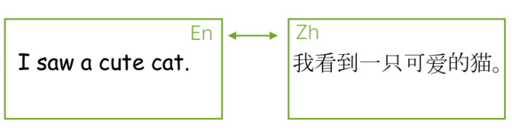
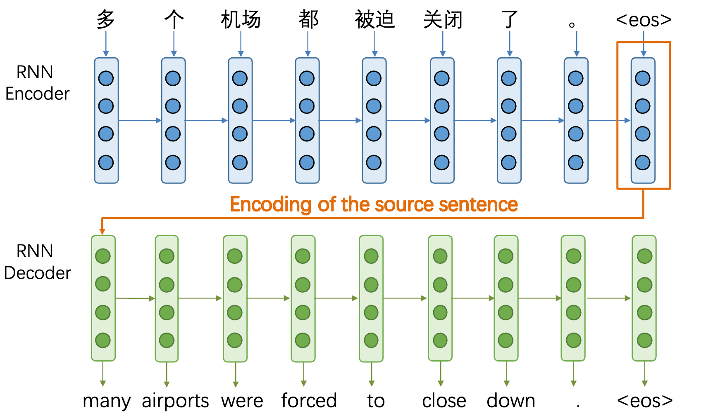
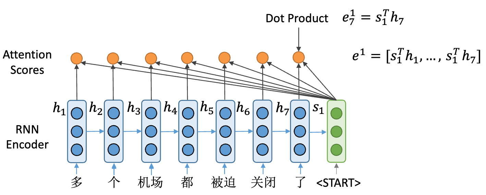
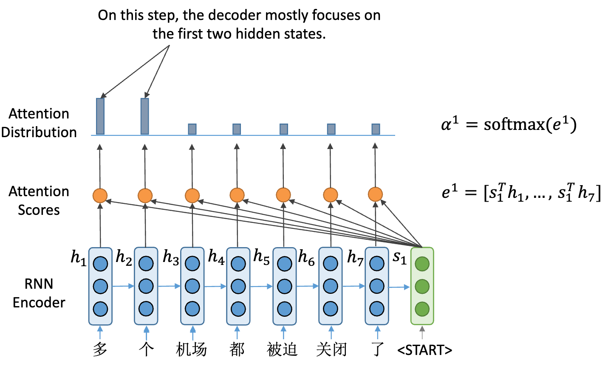
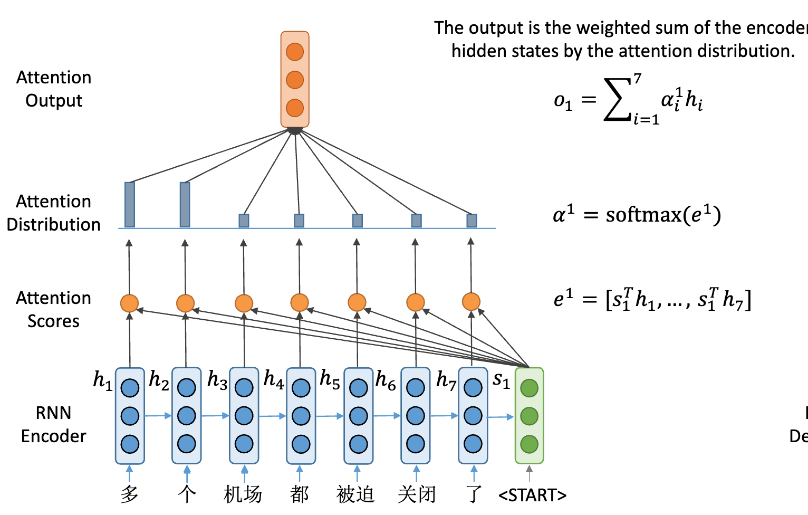
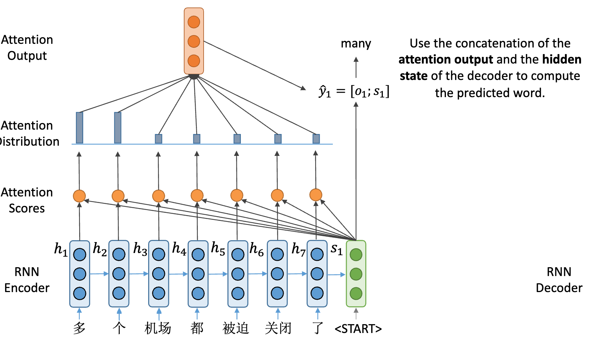

## Sequence to Sequence(seq2seq) and Attention

目前，最流行的seq2seq任务就是翻译，通常由一种自然语言翻译成另一种自然语言。当然除了自然语言互译外，还可以在编程语言之间进行翻译，更一般的是可以在任何标记的序列之间进行翻译，所以机器翻译可以指代任何一般的序列到序列的任务。

接下来将分别介绍seq2seq的基本概念，以及密不可分的attention(注意力机制)，最后介绍最流行的模型-Transformer。

### Seq2Seq模型

所谓Seq2Seq(Sequence to Sequence)，即序列到序列模型，就是一种能够根据给定的序列，通过特定的生成方法生成另一个序列的方法，同时这两个序列可以不等长，这种结构又叫Encoder-Decoder模型，即编码-解码模型，是RNN的一个变种，为了解决RNN要求序列等长的问题。

通常，在机器翻译中任务中，给定一个输入序列$x_1$,$x_2$,...,$x_m$ 和输出序列$y_1$,$y_2$,...,$y_n$。翻译要做的就是在给定输入的情况下知道最有可能的目标序列，即得到最大概率可能出现的y：$p(y|x):y^* = argmaxp(y|x)$。对于人类来所可以通过经验取推断出最有可能出现的y，但是在机器翻译中，我们需要通过学习带有参数$\theta$的函数$p(y|x,\theta)$来确定目标序列。

### 注意力机制

#### 什么是注意力机制

先简单介绍下机器翻译在NLP中是如何实现的，也就是典型的`seq2seq`模型，由`encoder`和`decoder`两部分组成。下图为中译英的seq2seq结构，输入为一个中文序列，输出为英文序列。工作原理是将encoder的输出语义向量(`thought vector` )作为decoder的初始状态`h0`，然后依次通过RNN逐个预测出下一个单词，其中encoder的语义向量包含整个输入序列的信息。

但是上面的模型通过RNN进行encode和decode存在着一些问题：当输入的seq很长时，尽管是使用LSTM也可能导致句子开头的一些信息遗失掉；此外decoder端每个字的产生，可能只和输入序列中的某几个字特别相关，但是实际却是以代表整个输入序列的语义向量来产生many这个词汇。因此为了解决上述几个问题，引入了`attention机制`：通过计算当前decoder的input与encoder的输入序列的每个向量相关性，来将模型的注意力聚焦在相关性更高的word。

#### 注意力机制计算过程

先定义几个变量`hi`表示Encoder的hidden state，si表示Decoder的hidden state

> 1.分别计算Decoder的第一个输入与每个Encoder的隐藏状态的attention score，

这里的打分函数使用的点积方式

> 2.通过softmax对结果进行归一化处理，得到了每个*`hi`*的权重

> 3.然后将Encoder的每个隐藏状态加权求和就得到了当前时刻的Attention Output  *`o1`*

> 4.将Attention Output和s1做concat操作，并输入

