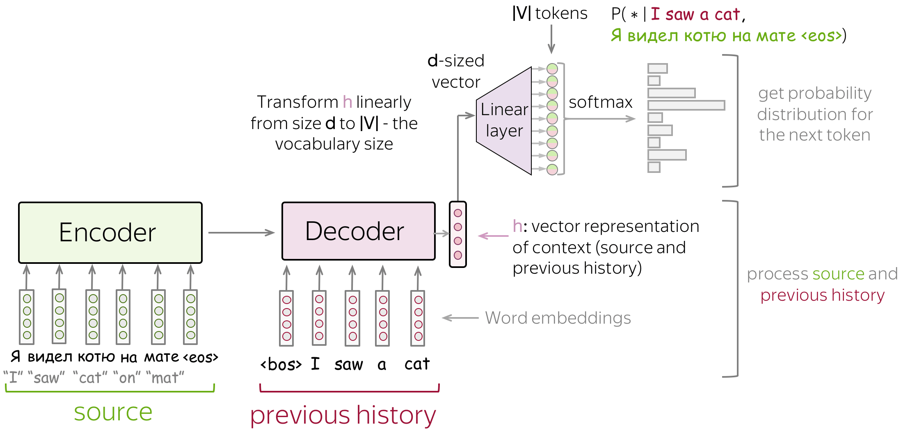
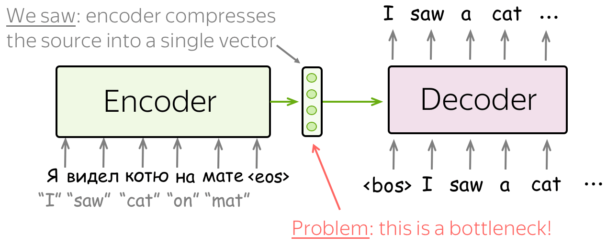

## Sequence to Sequence(seq2seq) and Attention

目前，最流行的seq2seq任务就是翻译，通常由一种自然语言翻译成另一种自然语言。当然除了自然语言互译外，还可以在编程语言之间进行翻译，更一般的是可以在任何标记的序列之间进行翻译，所以机器翻译可以指代任何一般的序列到序列的任务。

接下来将分别介绍seq2seq的基本概念，以及密不可分的attention(注意力机制)，最后介绍最流行的模型-Transformer。

### Seq2Seq模型

所谓Seq2Seq(Sequence to Sequence)，即序列到序列模型，就是一种能够根据给定的序列，通过特定的生成方法生成另一个序列的方法，同时这两个序列可以不等长，这种结构又叫Encoder-Decoder模型，即编码-解码模型，是RNN的一个变种，为了解决RNN要求序列等长的问题。

通常，在机器翻译中任务中，给定一个输入序列$x_1$,$x_2$,...,$x_m$ 和输出序列$y_1$,$y_2$,...,$y_n$。翻译要做的就是在给定输入的情况下知道最有可能的目标序列，即得到最大概率可能出现的y：$p(y|x):y^* = \arg \max p(y|x)$。对于人类来所可以通过经验取推断出最有可能出现的y，但是在机器翻译中，我们需要通过学习带有参数$\theta$的函数$p(y|x,\theta)$来确定目标序列。

#### Seq2Seq的应用场景

Seq2Seq的应用随着计算机科学与技术的发展，已经在很多领域产生了应用，如：

- 机器翻译：Seq2Seq最经典的应用，当前著名的Google翻译就是完全基于 Seq2Seq+Attention机制开发的。
- 文本摘要自动生成：输入一段文本，输出这段文本的摘要序列。
- 聊天机器人：第二个经典应用，输入一段文本，输出一段文本作为回答。
- 语音识别：输入语音信号序列，输出文本序列。
- 阅读理解：将输入的文章和问题分别编码，再对其解码得到问题的答案。
- 图片描述自动生成：自动生成图片的描述。
- 机器写诗歌，代码补全，故事风格改写，生成commit message等。

#### Encoder-Decoder 框架

Seq2Seq的基础结构由Encoder-Decoder组成，通常是由LSTM和GRU组成。编码器通过对输入序列进行学习，得到输入序列的特征表示$c$，然后将其作为解码器的输入来生成目标序列。

#### 条件语言模型

对于经典的语言模型，主要是估计标记序列$y=(y_1,y_2,...,yn)$的概率$p(y)$，比如LSTM：

Seq2Seq作为经典的条件语言模型(Conditional Language Models)，与语言模型的区别在于还给定了一个source $x$作为输入，所以其训练过程与LMs很相似。

值得注意的是，CLMs不单单是解决Seq2Seq任务，在更通用的场景中，source $x$还可以是标记序列以外的东西，比如在图像描述任务(Image Captioning task)中，$x$可以是图片，而$y$是对图片的描述。

因此，Seq2Seq的建模和训练过程与语言模型相似，pipeline的过程为：

- 将source $x$和前一个目标词汇喂入网络
- 从解码器中得到previous context(source和previous target tokens)的向量表示
- 根据向量表示预测下一个token的概率分布

#### 简单的Seq2Seq模型

最简单的Encoder-Decoder模型是由两个RNN(Lstm)组成，一个是Encoder，另一个是Decoder。Encoder Rnn读取输入序列，同时将最后一个时间步的state作为Decoder Rnn的初始化state。Encoder的最后一个状态包含输入序列的所有信息，这样Decoder可以基于这个状态向量生成目标序列。

上面的模型可以有一些改进的方式，比如编码器和解码器可以有多层，同时为了解决LSTM的长期依赖问题，比如在解码器在生成目标序列的开头时，可能已经忘记了与之最相关的早期输入的tokens，所以这里有一个trick可以有效解决这个问题：将source tokens进行翻转，target tokens不需要变，通过这种操作，模型就会产生很多的短期连接。

#### 训练

在训练过程中我们需要最大化模型分配给正确标记的概率，假设输入的训练序列为$x=(x_1,...,x_m)$，目标序列为$y=(y_1,...,y_n)$，在时间为$t$(timestep)时，模型预测的概率分布为$p^{(t)}=p(*|y_1,...,y_{t-1},x1,...,x_m)$。此时的target是$p^*=one-hot(y_t)$，也就是模型需要把概率1分配给正确的token,$y_t$,同时其他为0。

经典的损失函数就是交叉熵，目标分布$p^*$和预测分布$p$的loss为：
$$
Loss(p^*,p)=-p^*\log(p)=-\sum_{i=1}^{|V|}p_i^*\log(p_i).
$$
因为target为one-hot，所以只有一个位置($p_i^*$)为1，进一步：
$$
Loss(p^*,p)=-\log(p_{y_t})=-\log(p(y_t|y<t,x))
$$
也就是说在每一个timestep中会最大化模型分配给正确标记的概率：

最后是整个训练过程的图示：

#### 推理：贪婪解码和束搜索

上面展示了模型的训练过程，但是在推理时我们需要的不是模型的原始输出即概率分布，而是从概率分布中选择一个最终的结果(一个单词或者是一系列单词)作为输出，也就是一个解码的过程。比如上面的用于机器翻译的Seq2Seq模型，期望最终输出的是I saw a cat on a mat，也就是找到近似解：

常见的解码方式有贪婪解码和束搜索，他们有各自的优势和适用场景

> 贪婪解码(Greedy Decoding) - 每个时间步选择概率最高的词

最直接解码策略就是贪婪解码，也就是在每一个时间步生成时选择概率最高的那个词。这种方法实现简单，计算复杂度低，但是每个step的概率最高的词不一定就会组合成为最优的目标序列，也就是：

> 束搜索(Beam Search) - 保留k个概率最高的词

不同于贪婪解码只保留一个词，束搜索会保留概率最高的k个可能的序列(束宽)。这这种方法虽然更复杂，但是保证了生成序列的多样性和生成的质量。束宽通常为4-10，增加束宽会降低计算效率，更重要的是会降低质量。

### 注意力机制

#### 为什么需要Attention

在上面提到的Seq2Seq模型中，存在Fixed Encoder Representation问题。具体的，我们是把Encoder的最后一个时间步的hidden state作为Decoder的inital state，也就是将Encoder的source sentence压缩为单个向量，这就出现了两个问题：

- 对于Encoder，很难将整个sentence压缩为单个向量，同时将所有信息放入一个向量时，有可能会遗忘一些重要信息
- 对于Decoder，只看到从source sentence的一种特征表示，从固定表示()中提取相关信息。然而在每个timestep中，Decoder需要重点关注的source部分可能也不相同

#### 什么是Attention

Attention即注意力机制的出现有效解决了固定编码表示问题，其首次出现是在[Neural Machine Translation by Jointly Learning to Align and Translate](https://arxiv.org/pdf/1409.0473.pdf)

> 一句话形容Attention：At different steps, let a model "focus" on different parts of the input.

注意力机制是神经网络的一部分，在解码器的每个step中，用来决定哪部分的source token更重要。因此，编码器不必将整个source sen压缩为一个向量，而是给出所有source token的表示(所有RNN的hidden state而不是最后一个)

> 

先简单介绍下机器翻译在NLP中是如何实现的，也就是典型的`seq2seq`模型，由`encoder`和`decoder`两部分组成。下图为中译英的seq2seq结构，输入为一个中文序列，输出为英文序列。工作原理是将encoder的输出语义向量(`thought vector` )作为decoder的初始状态`h0`，然后依次通过RNN逐个预测出下一个单词，其中encoder的语义向量包含整个输入序列的信息。

但是上面的模型通过RNN进行encode和decode存在着一些问题：当输入的seq很长时，尽管是使用LSTM也可能导致句子开头的一些信息遗失掉；此外decoder端每个字的产生，可能只和输入序列中的某几个字特别相关，但是实际却是以代表整个输入序列的语义向量来产生many这个词汇。因此为了解决上述几个问题，引入了`attention机制`：通过计算当前decoder的input与encoder的输入序列的每个向量相关性，来将模型的注意力聚焦在相关性更高的word。

#### 注意力机制计算过程

先定义几个变量`hi`表示Encoder的hidden state，si表示Decoder的hidden state

> 1.分别计算Decoder的第一个输入与每个Encoder的隐藏状态的attention score，

这里的打分函数使用的点积方式

> 2.通过softmax对结果进行归一化处理，得到了每个*`hi`*的权重

> 3.然后将Encoder的每个隐藏状态加权求和就得到了当前时刻的Attention Output  *`o1`*

> 4.将Attention Output和s1做concat操作，并输入
